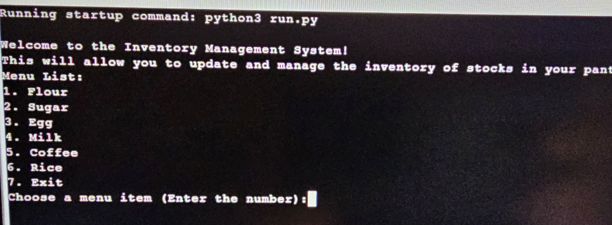
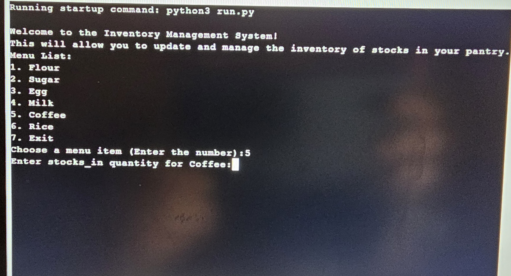
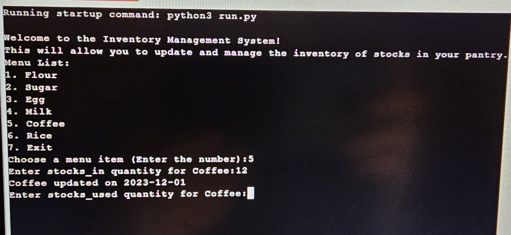
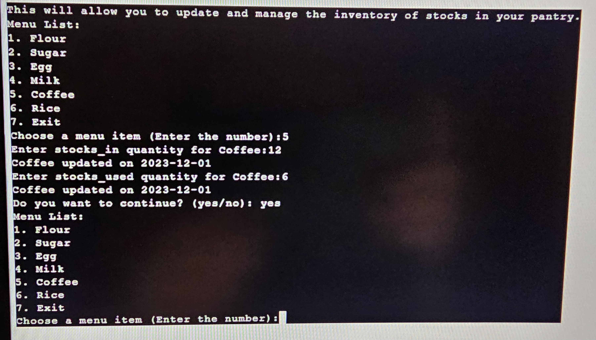
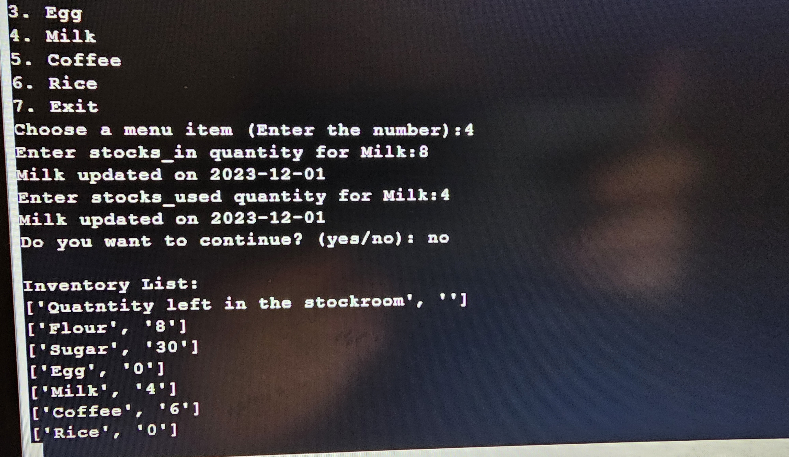
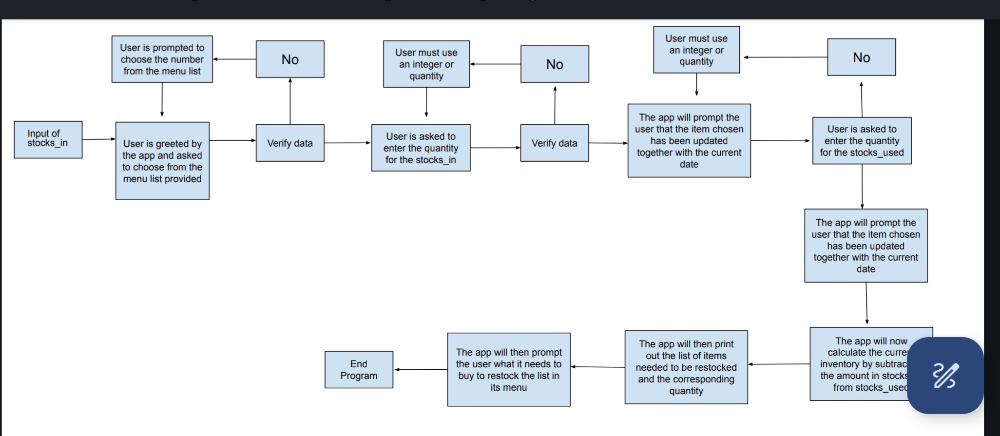
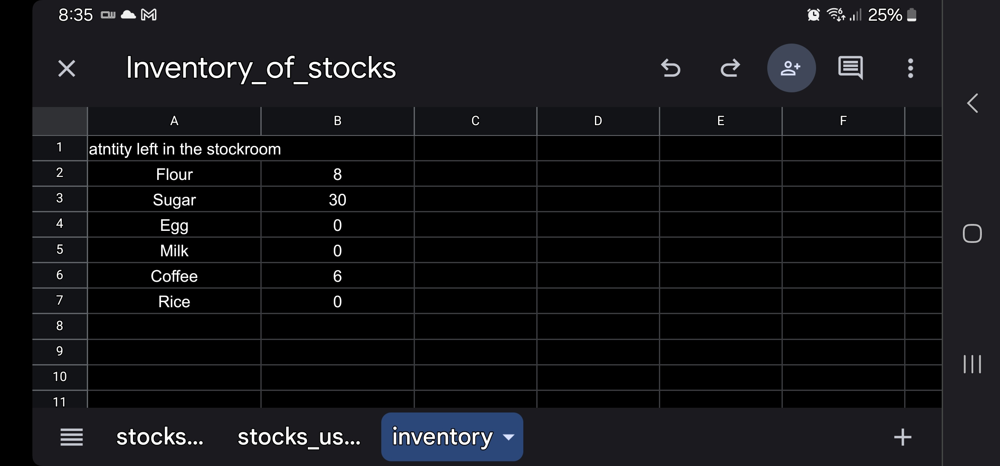
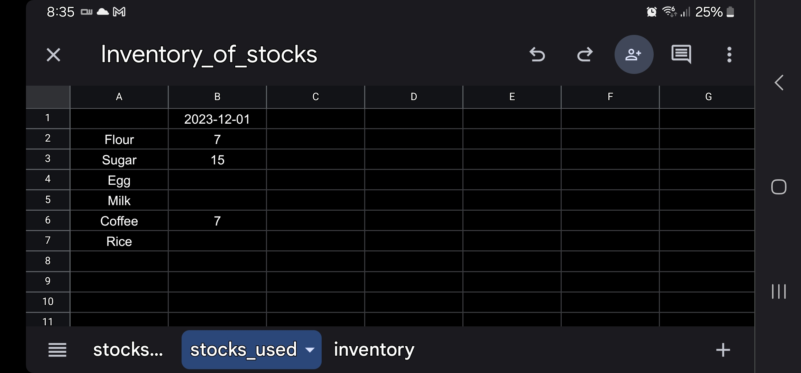
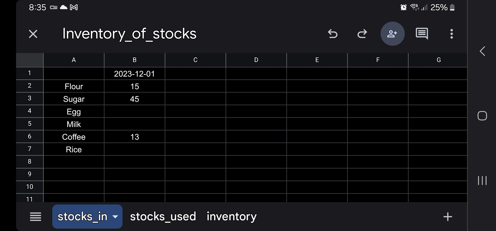
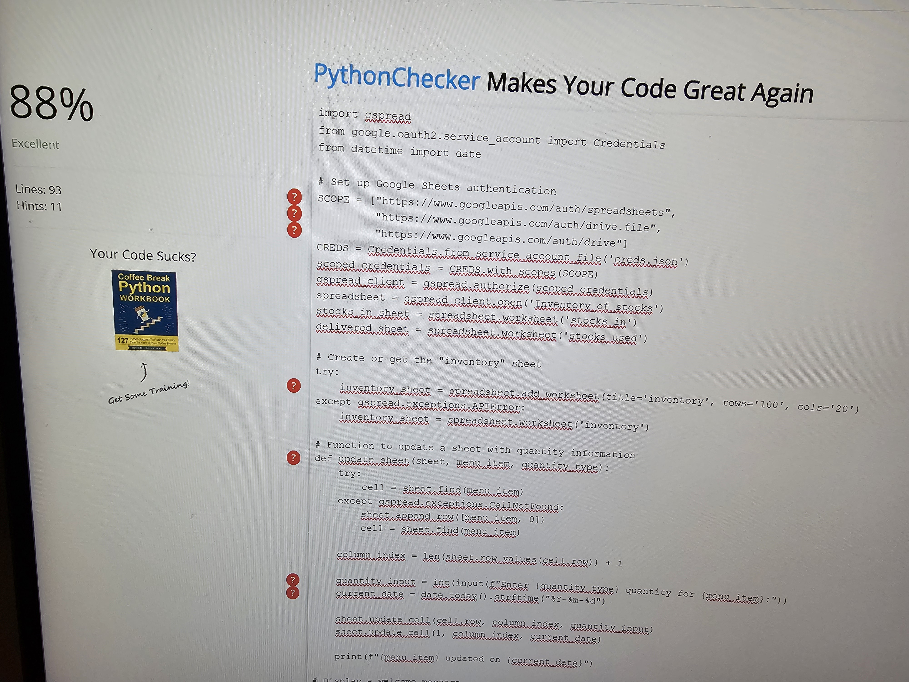

    INVENTORY MANAGEMENT SYSTEM

        This is an app is intended for users who are working on restaurants or in a big kitchen.
        This would be a useful app to have in monitoring the list of items you have in the kitchen or restaurant that you use daily 
        and would like to get a reminder of what to buy or restock the next day.

    FEATURES

        This program is intended for those user who has a big kitchen or a small restaurant to manage
        This will help the user in monitoring the flow of the stocks coming in and stocks that are being used
        To make their monitoring easy the User will just simply input the amount of stocks coming in and input
        also the stocks being used. Once the user has been done in encoding the data the program will automatically 
        compute the difference and tell the user how much is left in the pantry per item

        The app would work as follows:

     1. User will be greeted with a Welcome to INVENTORY MANAGEMENT SYSTEM !!!
     2. User is asked to choose from the Menu list which Item it wants to update

     
     3. User is then asked to enter the stocks_in
     4. The app will tell the user that it has sucessfuly updated the item and will show the date

     5. User is asked to enter the stocks_used
     6. The app will tell the user that it has sucessfully updated the item and will show the date

     7. The program will then ask the user if it wants to continue. If the user says yes the program goes
        back to the menu list

     7. The app then calculates the amount left in the stocks and placed it in the inventory
     8. The app will prompt the user the quantity it needs to shop to restock the list for the next day. 
     9.The app will also promt the user if it wants to print the said list so they can use for shopping.

FLOW OF WORK
    To start this project I created a workflow to make sure that I am aware of how my project would work
    and what source code I would need to make this program work

PROGRAM BUILD UP

    To create this program I needed to make sure that my python program is connected to my google sheets. 
    in order to do this I have first create my google sheets.

    After this I have to do the following:
    
    1. Activate my API credentials
    2. Creating my creds.json file
    3. Downloaded our credentials in python to connect to google sheets
    4. create our github repository
    5. Create file in Codeanywhere 
    6. Copy the json file and named it cres.json
    7. Copy the client email from Json file
    8. Go back to google sheet and paste the client email, paste it and click share. 
        Make sure to click editor
    7. Go to gitignore and write creds.json
    8. Commit and push your file

    Install dependencies

    1. Write the command 'pip3 install gspread google-auth'.  
    2. Write on top the following:
        import gspread
        from google.oauth2.service_account import Credentials
        from datetime import date

    3. Set up Google Sheets authentication

        SCOPE = ["https://www.googleapis.com/auth/spreadsheets",
               "https://www.googleapis.com/auth/drive.file",
                "https://www.googleapis.com/auth/drive"]
        CREDS = Credentials.from_service_account_file('creds.json')
        scoped_credentials = CREDS.with_scopes(SCOPE)
        gspread_client = gspread.authorize(scoped_credentials)
        spreadsheet = gspread_client.open('Inventory_of_stocks')
        stocks_in_sheet = spreadsheet.worksheet('stocks_in')
        delivered_sheet = spreadsheet.worksheet('stocks_used')

    4. Commit and push your file.

#TESTING

    I validated my code using the python syntax checker pep8

# DEPLOYMENT
    I deployed my project in both heroku and github
    the following steps were made:

        1. Created a repository from github
        2. Copied the repository URL for my repository
        3. Created a file in CodeAnywhere for my IDE.
        5. Run the new file in Codeanywhere

    Creating a file in Heroku

        1. created an app in Heroku
        2. Chose github as my deployment method
        3. Connected my github repository to heroku
        4. Change my Config vars in the setting
        5. Added a build up pack Python and Nodejs
        6. Heroku is now ready to deploy

# CREDITS AND REFERENCES

    https://github.com/burnash/gspread
    https://www.geeksforgeeks.org/inventory-management-with-json-in-python/
    https://stackoverflow.com/questions/14494747/how-to-add-images-to-readme-md-on-github
    https://docs.gspread.org/en/latest/user-guide.html
    https://realpython.com/python-datetime/
    https://realpython.com/python-exceptions/

