#    INVENTORY MANAGEMENT SYSTEM
This is program is a database for a small warehouse where we
the user can monitor stocks coming in and out of the warehouse.
The program can also let the user know the updated inventory of the warehouse
#    FEATURES
This program is intended for those who are managing a small warehouse
This will help the user in monitoring the flow of the stocks coming in and stocks that are being used
To make their monitoring easy the User will just simply input the amount of stocks coming in and input
also the stocks being used. Once the user has been done in encoding the data the program will automatically 
compute the difference and tell the user how much items are left in the warehouse.

# FLOW OF WORK
To start this project I created a workflow to make sure that I am aware of how my project would work
and what source code I would need to make this program work

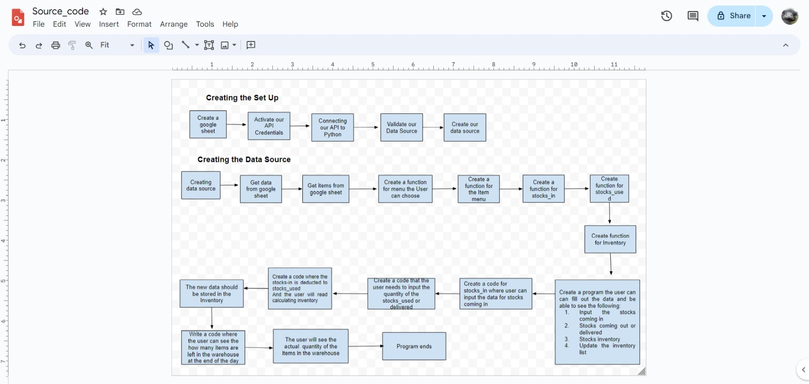

# PROGRAM BUILD UP
To create this program I needed to make sure that my python program is connected to my google sheets. 
in order to do this I have first create my google sheets.
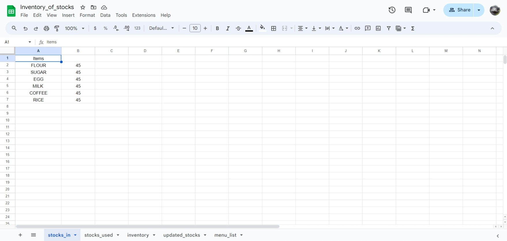
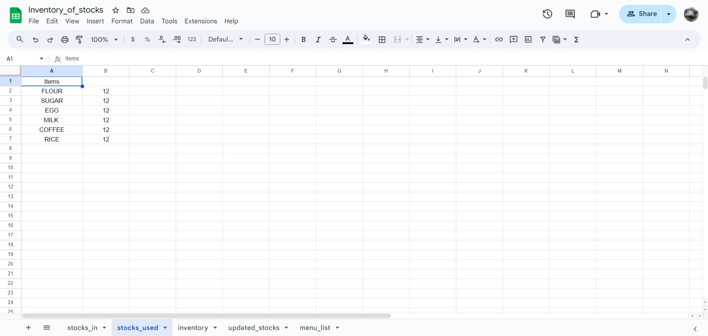
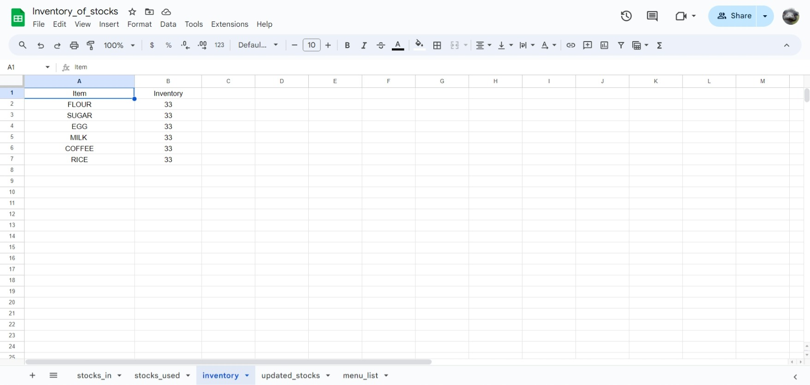

After this I have to do the following:
1. Activate my API credentials
2. Creating my creds.json file
3. Downloaded our credentials in python to connect to google sheets
4. create our github repository
5. Create file in Codeanywhere 
6. Copy the json file and named it cres.json
7. Copy the client email from Json file
8. Go back to google sheet and paste the client email, paste it and click share. 
    Make sure to click editor
7. Go to gitignore and write creds.json
8. Commit and push your file

Install dependencies

1. Write the command 'pip3 install gspread google-auth'.  
2. Write on top the following:
import gspread
from google.oauth2.service_account import Credentials
from datetime import date

3. Set up Google Sheets authentication
SCOPE = ["https://www.googleapis.com/auth/spreadsheets",
               "https://www.googleapis.com/auth/drive.file",
                "https://www.googleapis.com/auth/drive"]
        CREDS = Credentials.from_service_account_file('creds.json')
        scoped_credentials = CREDS.with_scopes(SCOPE)
        gspread_client = gspread.authorize(scoped_credentials)
        spreadsheet = gspread_client.open('Inventory_of_stocks')
        stocks_in_sheet = spreadsheet.worksheet('stocks_in')
        delivered_sheet = spreadsheet.worksheet('stocks_used')
4. Commit and push your file.

## The flow of the program is this:

The User is prompted with the following message
Welcome to warehouse management system.
The the user can see the Menu list
Menu list
1. Updating the stock_in
2. Updating the stocks_used
3. Updating the inventory
4. Updating the inventory with the stocks_in
5. Exit
Enter your choice:
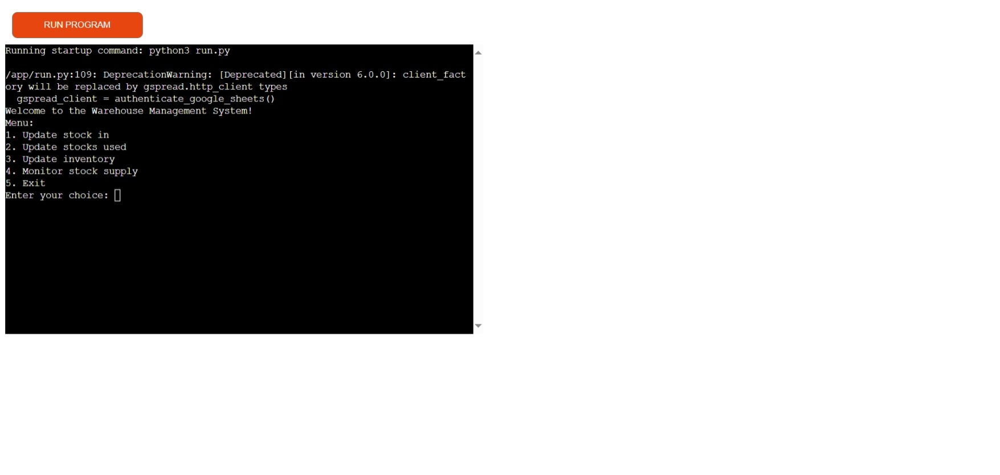

For 1.  The user can input data for following menu list
Menu List:
1. FLOUR
2. SUGAR
3. EGG
4. MILK 
5. COFFEE
6. RICE
7. Exit
As the input  data is saved in the google sheet named stocks_in
The data is printed out  for the user to see
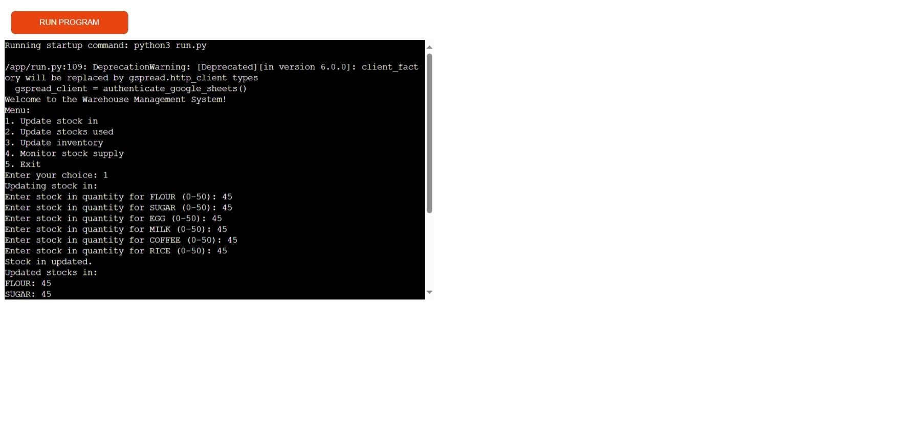
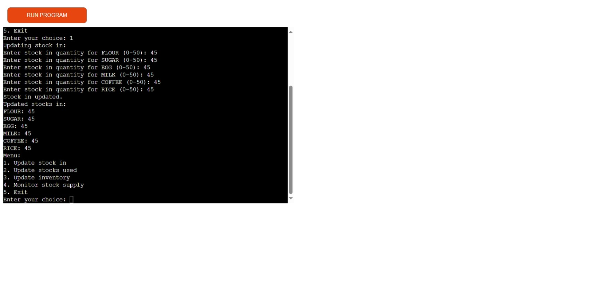

For 2. The user can input the data for the following menu list
Menu List:
1. FLOUR
2. SUGAR
3. EGG
4. MILK 
5. COFFEE
6. RICE
7. Exit
The input data is saved in the google sheet named stocks_used
The data is  printed out the data for the user to see

3.Updating the inventory. 
When the user chooses this number the difference is calculated between stocks_in and stocks_used. 
When it is  done updating, it  prints out the final data for the user to see

4.Monitor stocks supply.
When the user chooses this function, it will calculate the sum of both stocks_in and inventory. 
Then it prints out the sum stating the updated items in the warehouse.
The program ends and we say thank you for using the program and have a nice day!

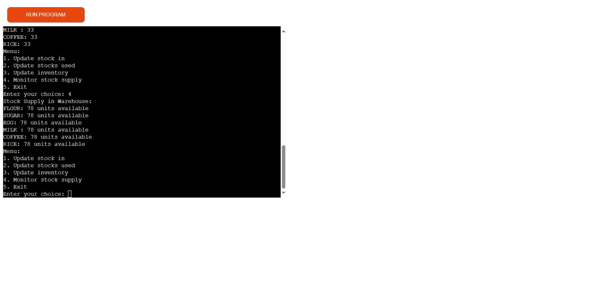
5. Exit. If the user chooses this, the program ends and 
says thank you for using the program and have a nice day!
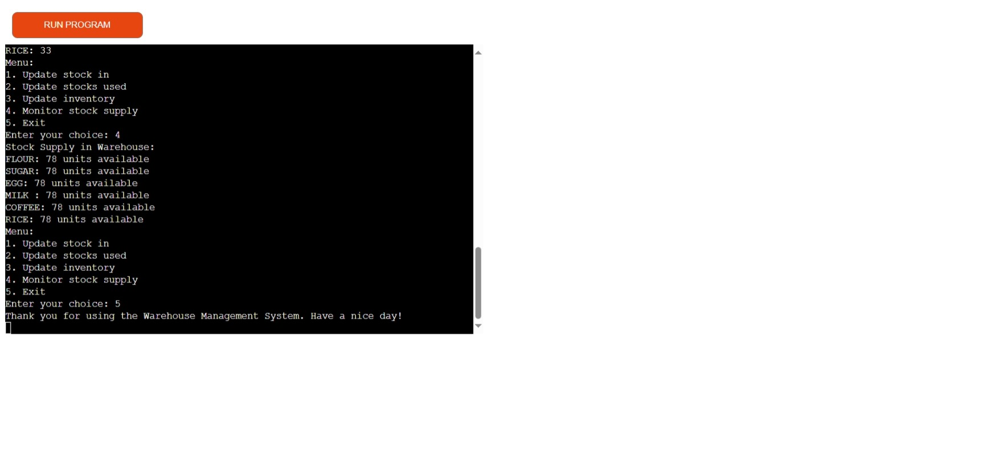

# DEPLOYMENT
I deployed my project in both heroku and github
the following steps were made:
1. Created a repository from github
2. Copied the repository URL for my repository
3. Created a file in CodeAnywhere for my IDE.
4. Run the new file in Codeanywhere

Creating a file in Heroku

1. created an app in Heroku
2. Chose github as my deployment method
3. Connected my github repository to heroku
4. Change my Config vars in the setting
5. Added a build up pack Python and Nodejs
6. Heroku is now ready to deploy

# TESTING
I validated my code by installing the pycodestyle using this code
pip install pycodestyle

Once the program was installed I ran the terminal using the code 
pycodestyle run.py

to validate my program

I also installed pip install autopep8
and run in the terminal the code 
autopep8 --in-place --aggressive --aggressive run.py
to edit automatically fix some violations. 
However, not all violations can be fix by this program. 

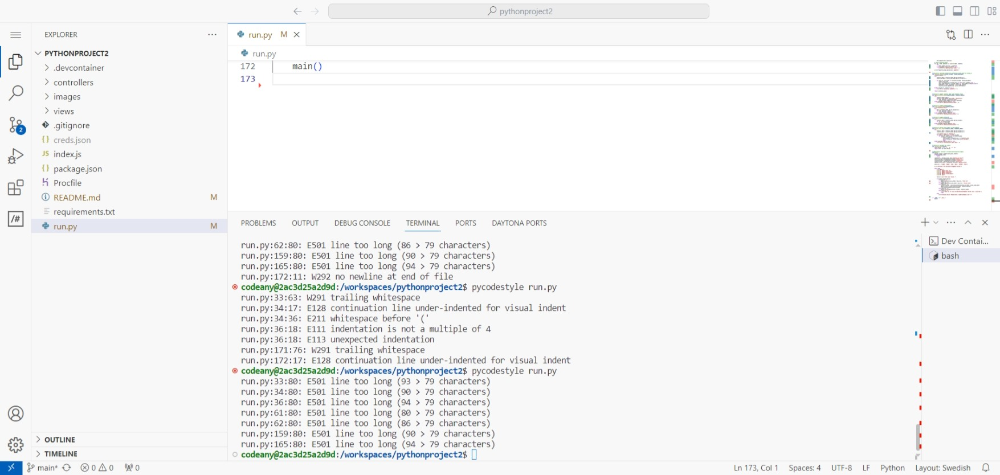

after making the codes shorter. Don' know if the codes pass or not. 
No validation was mentioned if the program passed the code for pep8
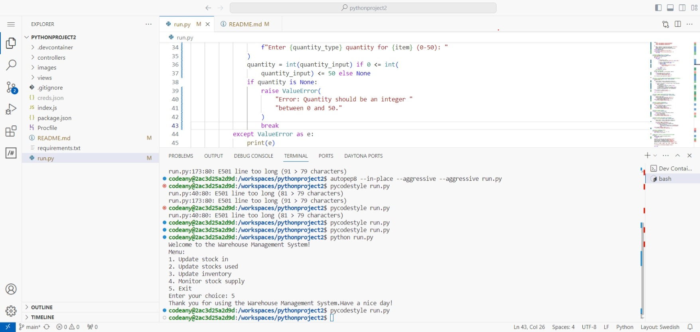

# CREDITS AND REFERENCES

https://github.com/burnash/gspread
https://www.geeksforgeeks.org/inventory-management-with-json-in-python/
https://stackoverflow.com/questions/14494747/how-to-add-images-to-readme-md-on-github
https://docs.gspread.org/en/latest/user-guide.html
https://realpython.com/python-datetime/
https://realpython.com/python-exceptions/
https://peps.python.org/pep-0008/

# Other Concerns:
The program is working due to time constraints we were not able to do the following
and problems happening in the IDE codeanywhere. We were not able to do the following
codes:

1.The program should have been able to store current and the previous data
2.A date and time stamp should have been present
    so that the user will know what date and time the data was encoded
3.It should also be able to print out past data if the user wish to see it 
4.The user should be able to add or delete items in the Menu list. 
  And should have a standardized menu list connected to all the sheets

